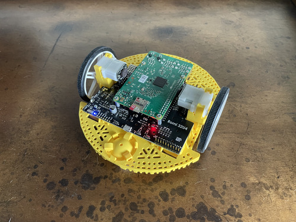

# MoonRobot

This a Robot Demo for running cFS on a Pi-compatible Linux platform.  The goal is to illustrate how to set up a cFS project in a tangible way for people getting started using the framework.

The project contains the necessary Ground Station tooling to command the
robot motors via I2C.  In order to do so, you must:

- Start the FSW on the RPi (probably as root for I2C access)
- Start the Ground Station on your local machine
- Send an Enable Telemetry command to the Pi's IP directing it to the local machine's IP
- Set the Pi's IP for commanding the ROMIMOT App
- Send the Motor Enable command to enable motor control and connect to the I2C bus
- Send a Set Target Delta command to set the movement speed to something other than 0 (50 - 150 is good)
- Send a Set Target command to change the ending Odometer target, relative to the current Odo reading in Odo Ticks (start with 2000 or so).

## Pololu Romi

The Romi was selected as the plaftorm for this project, largely because the parts are available and easily purchased.  Specific consideration was given to minimizing the amount design work and striving for relatively low assembly difficulty, in order to focus on the software learning.

- [Pololu Romi Chassis Kit](https://www.pololu.com/product/3504) - Ours were white and yellow, but any color will do
- [Pololu Romi Encoder Pair Kit](https://www.pololu.com/product/3542) - Requires soldering but a no-solder motor/encoder pair is available
- [Pololu Romi 32U4 Control Board](https://www.pololu.com/product/3544) - Provides and interesting and programmable Atmeta34u4 to communicate with
- Raspberry Pi with WiFi access - Wifi setup is beyond the scope of this repo, we used a 3B+ and 4B
- 6 AA Batteries - Your local grocery or home improvement store

## Software Architecture

Using the cFS paradigm, everything is corraled into apps, stored within the apps folder.  The different functionality of the robot is broken up into different apps, to maximize re-usability and minimize the inter-dependency.

There is only one demo app, due to time constraints for building multiple apps in time for the live demo.

<!--- Explain each app in use with bullet points --->

## Building the cFS Project

Some effort was put into attempting to run a native ``cmake`` build, but as of currently it does not work.  The cFE build system calls ``cmake`` from within ``make`` from within ``cmake``, which seems to break some core assumptions about how build folders are laid out.  In effort to make the build process simple, we have included the sample ``Makefile`` in the root folder, to remove the extra step of copying it around.

To build the project on the Raspberry Pi, or a suitably compatible ARM build host, run the following commands:

    make SIMULATION=native prep
    make
    make install

This will result in a build folder, where the necessary artifacts are located in:

    ./build/exe/cpu1/

If you have built locally on the Pi, you can ``cd`` into this directory and run the cFS executable ``./core-cpu1``.  If you built on a build host, you must copy everything within the ``cpu1`` folder to the Pi, and then execute on the Pi.
